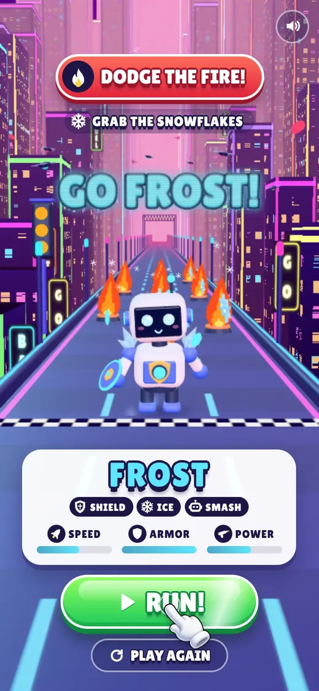
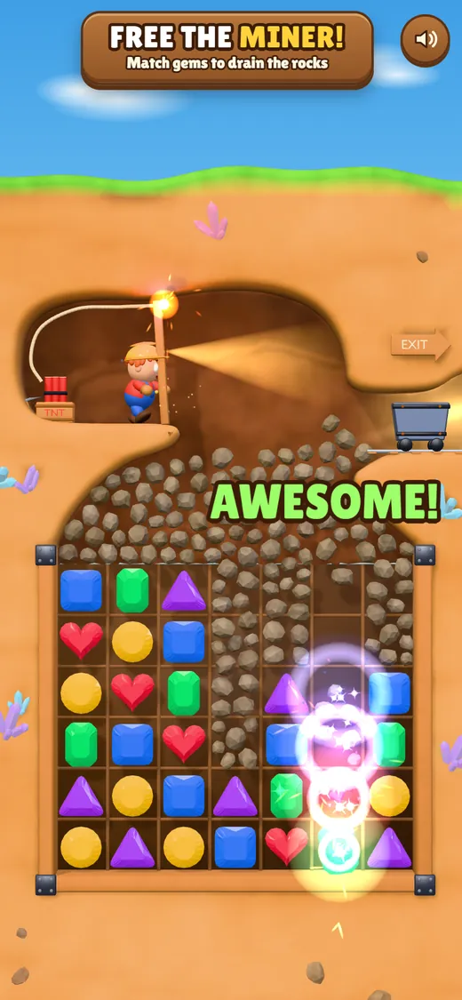
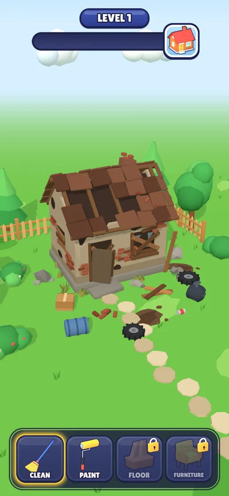
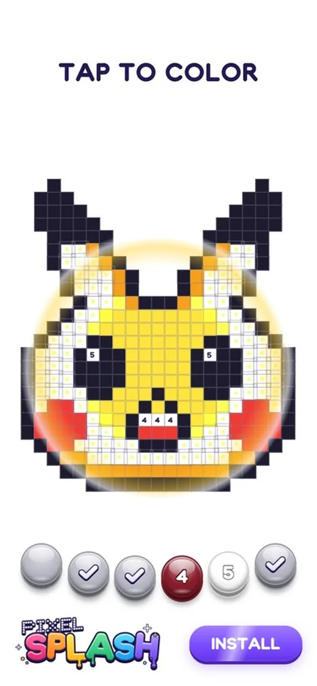
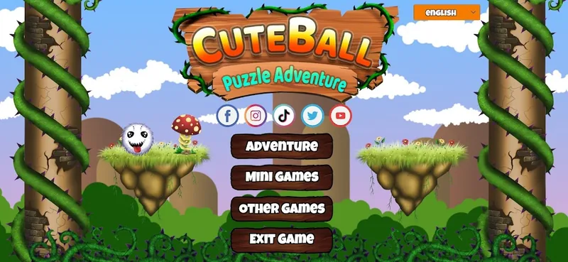

# Anderson Igarashi

**Playable Game Developer** · HTML5 playable ads · Unity · AI-assisted pipelines 
Brazil (UTC-3) · Remote

[Portfolio](https://andersonigarashi.github.io) · [LinkedIn](https://www.linkedin.com/in/anderson-igarashi/) · [ArtStation](https://www.artstation.com/andersonigarashi) · [VFX reel](https://www.youtube.com/watch?v=smPp1w7Z7aY) · [anderigarashi@gmail.com](mailto:anderigarashi@gmail.com)

I'm a Playable Game Developer and Technical Artist with 8+ years in game development and 3+ years focused on playable games, interactive ads and rapid prototyping. I take a creative brief to a shipped, optimized build on my own: mechanics, UI, onboarding, feedback and polish, then testing across devices and delivery. I work in Unity and C#, and in TypeScript and JavaScript with Three.js and Pixi.js, with a background in 3D, VFX and shaders. I use AI tools every day for code, prototyping, 3D assets and audio, and I review and own everything they produce.

## Playable ads you can play in the browser

<table>
  <tr>
    <td align="center" width="25%">
      
    </td>
    <td align="center" width="25%">
      
    </td>
    <td align="center" width="25%">
      
    </td>
    <td align="center" width="25%">
      
    </td>
  </tr>
  <tr>
    <td valign="top">
      <b>Build Your AI</b> 
      Build an AI racer in three taps, watch it assemble in 3D, then race it through a neon city. Every model, texture and sound is generated at runtime. 
      TypeScript · Three.js · GLSL 
      <a href="https://andersonigarashi.github.io/robot_rescue/">Play</a> · <a href="https://github.com/AndersonIgarashi/robot_rescue">Code</a> · <a href="https://github.com/AndersonIgarashi/robot_rescue#how-it-was-built-ai-workflow">How it was built</a>
    </td>
    <td valign="top">
      <b>Mine Rescue</b> 
      A cave-in has trapped a miner and the TNT fuse is lit. Match gems under the rubble and the rocks pour into the holes with real physics. Every model was built in Blender through an AI-driven pipeline. 
      TypeScript · Three.js · Blender MCP 
      <a href="https://andersonigarashi.github.io/help_the_character/">Play</a> · <a href="https://github.com/AndersonIgarashi/help_the_character">Code</a> · <a href="https://github.com/AndersonIgarashi/help_the_character#how-it-was-built-ai-workflow">How it was built</a>
    </td>
    <td valign="top">
      <b>Build Your Dream House</b> 
      Sweep a wrecked yard, watch the house rebuild, then paint it. Every model was built in Blender through an AI-driven pipeline. 
      three.js · pixi.js · Blender MCP 
      <a href="https://andersonigarashi.github.io/HouseCleanerPlayable/">Play</a> · <a href="https://github.com/AndersonIgarashi/HouseCleanerPlayable">Code</a> · <a href="https://github.com/AndersonIgarashi/HouseCleanerPlayable#how-it-was-built-ai-workflow">How it was built</a>
    </td>
    <td valign="top">
      <b>Pixel Splash</b> 
      Tap a color and a drop of paint splashes a wave across the picture. The font, logo, icons and sounds are all generated by code. 
      TypeScript · DOM and CSS · Python 
      <a href="https://andersonigarashi.github.io/coloring_using_number/">Play</a> · <a href="https://github.com/AndersonIgarashi/coloring_using_number">Code</a> · <a href="https://github.com/AndersonIgarashi/coloring_using_number#how-it-was-built-ai-workflow">How it was built</a>
    </td>
  </tr>
</table>

Each one is a complete playable: first-tap gameplay, tutorial hand, game feel, end card and CTA, shipped as a single HTML file for ad networks.

## How I work with AI

AI agents write much of my code and generate many of my assets. My job is the direction and the review.

1. **Brief.** Scope, flow, art direction and the one feeling the ad has to leave.
2. **Build with agents.** Claude Code writes TypeScript and shaders in the repo, one commit per milestone, and models 3D assets in Blender through the Blender MCP.
3. **Play and review.** I play every build on a phone and on desktop, at every aspect ratio, and check the console, the frame rate and the build size.
4. **Fix and own.** I send back what feels wrong, fix art by hand when that is faster, and can explain every line that ships.

Each project's README has a "How It Was Built" section with the real changes I made after playing it, like the end card I redesigned in Build Your AI and a shader bug that only looked like z-fighting.

## Shipped games

**[Cuteball Puzzle Adventure](https://play.google.com/store/apps/details?id=com.ToninhaGames.robloball)** is my own mobile game on Google Play, published under my Toninha Games label. I took it from idea to store on my own: gameplay, UI, ad integration, in-app purchases, analytics and release.

## Technical art

Real-time VFX, shaders and 3D art, optimized for mobile and standalone hardware: [VFX reel](https://www.youtube.com/watch?v=smPp1w7Z7aY) · [ArtStation](https://www.artstation.com/andersonigarashi)

## Toolbox

Unity · C# · TypeScript · JavaScript · HTML5 · CSS · Three.js · Pixi.js · WebGL · GLSL · Blender · Python · Claude Code · Blender MCP
